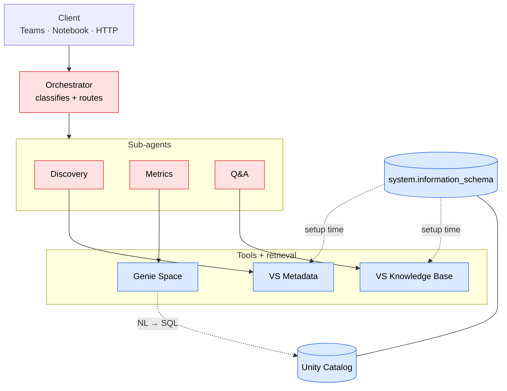

# UC Data Advisor — Deployment Guide

Deploy a multi-agent Unity Catalog data advisor on any Databricks workspace (AWS or Azure). The setup pipeline auto-creates all infrastructure, registers agents as MLflow models on Model Serving, and generates all content from your catalog metadata.

For Microsoft Teams integration, see [`teams/README.md`](teams/README.md) — two supported patterns covering public-workspace and fully-private (Private Link + NCC) deployments.

## Prerequisites

- **Databricks workspace** with Unity Catalog enabled
- **Databricks CLI** installed and authenticated (`databricks auth login --profile <name>`)
- **Python 3.12+** with `uv` installed
- **Source data catalogs** already populated in Unity Catalog
- **Service principal** created in the workspace (you must own it to generate OAuth secrets)
- Deployer must have **workspace admin** or equivalent permissions to create catalogs, endpoints, and secret scopes

## Quick Start

```bash
# 1. Clone the repo
git clone https://github.com/guanjieshen/uc-data-advisor.git
cd uc-data-advisor

# 2. Create your config
cp config/advisor_config.example.yaml config/my_config.yaml
```

The config lives in two files side by side:

- **`config/my_config.yaml`** — user-authored. You fill it in once. Never written by the pipeline.
- **`config/my_config.generated.yaml`** — pipeline-managed. Auto-populated on first run with infrastructure IDs, prompts, benchmarks, agent endpoint references. Safe to delete to force a clean re-run. Do not hand-edit.

Edit `config/my_config.yaml` — you need to set 3 things:

```yaml
# 1. Source catalogs (REQUIRED)
source_catalogs:
  - my_catalog_operations
  - my_catalog_analytics

# 2. Workspace connection (REQUIRED)
workspace:
  host: "https://my-workspace.cloud.databricks.com"
  profile: my-profile

# 3. Service principal (REQUIRED)
service_principal: "xxxxxxxx-xxxx-xxxx-xxxx-xxxxxxxxxxxx"
```

```bash
# 3. Run the full setup pipeline
uv run python -m src.setup.run --config config/my_config.yaml

# Pipeline runs: provision → grant-uc → audit → generate → register →
#   deploy-agents → grant-agent-permissions → deploy
```

The orchestrator endpoint name is printed at the end. Test it in the Model Serving playground or via the benchmark notebook.

## What the Setup Pipeline Does

The pipeline runs 8 steps in sequence (verify and teardown are run separately):

### Step 1: Provision Infrastructure

Creates all Databricks resources (idempotent — safe to re-run):

| Step | Resource | How Created |
|------|----------|-------------|
| 1 | **SQL Warehouse** | Auto-discovers first available, or uses `warehouse_id` from config |
| 2 | **Advisor Catalog** | `CREATE CATALOG IF NOT EXISTS` (falls back to default storage if managed location fails) |
| 3 | **Vector Search Endpoint** | SDK `create_endpoint()`, polls until ONLINE |
| 4 | **LLM Endpoint** | Uses pay-per-token foundation model (e.g. `databricks-claude-opus-4-6`) |
| 5 | **Genie Space** | REST API, populated with source tables in deploy stage |
| 6 | **SP OAuth Secret** | Generates secret for configured SP, stores in Databricks secret scope |

### Step 2: Grant UC Permissions

Grants the configured service principal access to all required resources:
- `USE CATALOG` + `SELECT` on each source catalog (+ `USE SCHEMA` per schema)
- `ALL PRIVILEGES` on advisor catalog
- `USE SCHEMA` + `SELECT` on `system.information_schema` and `system.access`
- `CAN_USE` on SQL warehouse
- `CAN_RUN` on Genie Space
- `workspace-access` entitlement

### Step 3: Audit Metadata

Queries `system.information_schema` as the configured SP for enriched metadata:
- Catalogs, schemas, tables, columns (types, defaults, precision)
- Table and column tags (governance labels)
- Primary key / foreign key constraints
- Table lineage (upstream/downstream from `system.access.table_lineage`)
- Table privileges (who has access)
- Volumes and file listings
- Computes metadata description coverage percentage

### Step 4: Generate Content

From the audit, auto-generates:
- **System prompts** — per-agent prompts with organization name and data domains
- **Knowledge base** — 10+ governance FAQs plus per-catalog and per-table dynamic FAQs
- **Benchmark questions** — 8 questions across discovery, metrics, QA, and general categories
- **Genie Space table list** — source tables + materialized metric tables

### Step 5: Register Agent Models

Registers each agent (discovery, metrics, qa, orchestrator) as an MLflow model in Unity Catalog using the model-from-code pattern. Models are versioned and deployed in parallel.

### Step 6: Deploy Agent Endpoints

Deploys each registered model to its own Model Serving endpoint via the Databricks SDK (`serving_endpoints.create`/`update_config`). Endpoints:
- Scale-to-zero is on by default; flip `scale_to_zero: false` in your config to keep them warm
- Receive SP credentials as `{{secrets/<scope>/sp-client-id}}` and `{{secrets/<scope>/sp-client-secret}}` env-var references (resolved by Model Serving at runtime against the workspace secret scope)
- Receive environment variables for Genie Space, VS indexes, LLM endpoint, and `SOURCE_CATALOGS`
- Sub-agents (discovery, metrics, qa) deployed in parallel; orchestrator deployed last with sub-agent endpoint names

### Step 7: Grant Agent Endpoint Permissions

Waits for all agent endpoints to be READY, then grants `CAN_QUERY` to the configured SP.

### Step 8: Deploy Artifacts

1. Writes enriched metadata docs (tables + volumes with tags, constraints, lineage, privileges) to Delta table + creates Vector Search index (delta sync)
2. Writes knowledge base FAQs to Delta table + creates Vector Search index (delta sync)
3. Updates Genie Space table list

Agents query the VS indexes at runtime — no SQL warehouse needed for metadata lookups.

## Permissions

The pipeline uses a single user-provided service principal for everything:

| What | How |
|------|-----|
| **UC grants** | `USE CATALOG`, `SELECT`, `ALL PRIVILEGES` via SQL |
| **Warehouse access** | `CAN_USE` via permissions API |
| **Genie Space access** | `CAN_RUN` via permissions API |
| **Endpoint access** | `CAN_QUERY` via SDK |
| **Model Serving auth** | OAuth M2M — secret generated and stored in Databricks secret scope |
| **Workspace access** | `workspace-access` entitlement via SCIM |

## Running Individual Steps

```bash
uv run python -m src.setup.run --config config/my_config.yaml --step provision
uv run python -m src.setup.run --config config/my_config.yaml --step grant-uc
uv run python -m src.setup.run --config config/my_config.yaml --step audit
uv run python -m src.setup.run --config config/my_config.yaml --step generate
uv run python -m src.setup.run --config config/my_config.yaml --step register
uv run python -m src.setup.run --config config/my_config.yaml --step deploy-agents
uv run python -m src.setup.run --config config/my_config.yaml --step grant-agent-permissions
uv run python -m src.setup.run --config config/my_config.yaml --step deploy
uv run python -m src.setup.run --config config/my_config.yaml --step verify
uv run python -m src.setup.run --config config/my_config.yaml --step teardown
uv run python -m src.setup.run --config config/my_config.yaml --step all  # default
```

## Config Reference

Required fields:

```yaml
source_catalogs:          # List of Unity Catalog catalogs to scan
  - my_catalog
workspace:
  host: "https://..."     # Workspace URL
  profile: my-profile     # CLI profile (or use token/host-only auth)
service_principal: "xxx"  # SP application (client) ID — you must own this SP
```

Optional overrides (all have smart defaults if omitted):

```yaml
app_name: my-project-advisor           # Default: derived from catalog prefix, MUST be unique per metastore
warehouse_id: "abc123def456"           # SQL warehouse ID (auto-discovered if omitted)
advisor_catalog: my_project_catalog    # Default: {app_name}_catalog
external_location: "my-ext-loc-name"   # UC external location for catalog storage (auto-detected)
serving_model: databricks-claude-opus-4-6  # Foundation model for LLM calls
embedding_model: databricks-bge-large-en   # VS embedding model
scale_to_zero: true                    # Agent endpoints scale-to-zero when idle (default true)
enable_metric_views: false             # Generate metric views and materialized tables
enable_volume_indexing: false          # Index UC Volume contents in the metadata VS index
enable_ai_gateway_guardrails: false    # Enable input safety guardrails on agent endpoints
rate_limits:                           # AI Gateway rate limits on agent endpoints (optional)
  - calls: 120
    key: user                          # "user" (per-user) or "endpoint" (shared)
    renewal_period: minute             # "minute" or "day"
include_schemas: []                    # Restrict to specific schemas
exclude_schemas: [staging, temp]       # Skip these schemas
```

## Architecture



Each of `Orchestrator`, `Discovery`, `Metrics`, `Q&A` is its own Model Serving endpoint.

- **Orchestrator endpoint**: Single entry point — classifies intent via LLM, routes to sub-agent endpoints, handles general responses directly
- **Discovery via VS index**: Queries a pre-built metadata index containing tables, volumes, columns, tags, constraints, lineage, privileges — no runtime SQL
- **Model Serving**: Each agent runs on its own endpoint with scale-to-zero. Authenticates outbound calls via SP OAuth M2M
- **Genie Space**: Metrics agent sends natural language questions to Genie, which translates to SQL and returns results
- **Vector Search**: Discovery agent uses a metadata VS index for semantic table search. QA agent uses a knowledge base VS index for FAQ retrieval. Both are delta sync
- **Secret Scope**: SP credentials stored securely, read at deploy time and injected as endpoint env vars

## Teardown

To delete all resources created by the pipeline:

```bash
uv run python -m src.setup.run --config config/my_config.yaml --step teardown
```

This deletes (in order):
1. Agent deployments and serving endpoints
2. Vector Search indexes
3. Genie spaces
4. Secret scope
5. Vector Search endpoint
6. Advisor catalog (CASCADE)

The pipeline clears the `infrastructure` and `generated` sections in `<name>_config.generated.yaml` on teardown so subsequent runs start clean. Your user-authored `<name>_config.yaml` is never modified. You can also delete the `.generated.yaml` file outright to force a fully fresh state.

## Benchmarks

The benchmark suite runs 8 questions across all 4 agent types (discovery, metrics, QA, general) and validates routing accuracy and response quality.

### Option 1: Databricks notebook (recommended)

Upload `tests/benchmark_notebook.py` to your workspace and run it on any cluster. Calls agent serving endpoints directly via the Databricks SDK — no external auth needed.

1. Import the notebook: **Workspace > Import > File > `tests/benchmark_notebook.py`**
2. Set the `config_path` widget to your uploaded config file path
3. **Run All**

### Option 2: Pipeline verify step (local)

```bash
uv run python -m src.setup.run --config config/my_config.yaml --step verify
```

### Option 3: Standalone script (local)

```bash
APP_URL="https://your-app.aws.databricksapps.com" \
  uv run python tests/benchmark.py
```

### Benchmark criteria

| Status | Meaning |
|--------|---------|
| **PASS** | Correct routing, response has content, no errors |
| **WARN** | Correct routing but response contains error/unavailable messages, or routing mismatch |
| **FAIL** | HTTP error, timeout (300s), or empty response |

## Updating After Deployment

Re-run specific steps to update:

```bash
# After adding new source tables — re-audit, regenerate, and redeploy artifacts
uv run python -m src.setup.run --config config/my_config.yaml --step audit
uv run python -m src.setup.run --config config/my_config.yaml --step generate
uv run python -m src.setup.run --config config/my_config.yaml --step deploy

# To update agent code — re-register models and redeploy endpoints
uv run python -m src.setup.run --config config/my_config.yaml --step register
uv run python -m src.setup.run --config config/my_config.yaml --step deploy-agents
uv run python -m src.setup.run --config config/my_config.yaml --step grant-agent-permissions
```

## Troubleshooting

**Warehouse not found**: Either start a warehouse in the workspace UI, or pass `warehouse_id` in your config.

**VS endpoint stuck provisioning**: VS endpoints can take 5-10 minutes. Re-run `--step provision` — it detects the existing endpoint.

**Agent endpoints timeout**: First request after scale-to-zero takes up to 5 minutes (cold start). The benchmark uses a 300s timeout.

**Genie Space errors**: Ensure the SP has `CAN_RUN` on the Genie space and `CAN_USE` on the SQL warehouse. Re-run `--step grant-uc`.

**Knowledge base unavailable**: VS indexes take a few minutes to sync after creation. Wait and retry.

**Model registration fails (S3/ABFSS access denied)**: Some workspaces restrict artifact uploads from local machines. Run the register step from a Databricks notebook or cluster.

**Permission denied on sub-agent endpoints**: `agents.deploy()` resets endpoint permissions. Always run `--step grant-agent-permissions` after `--step deploy-agents`.

**Invalid secret provided**: The `{{secrets/...}}` syntax isn't supported on all workspaces. The pipeline falls back to reading secrets from the scope at deploy time and passing them as env vars.
