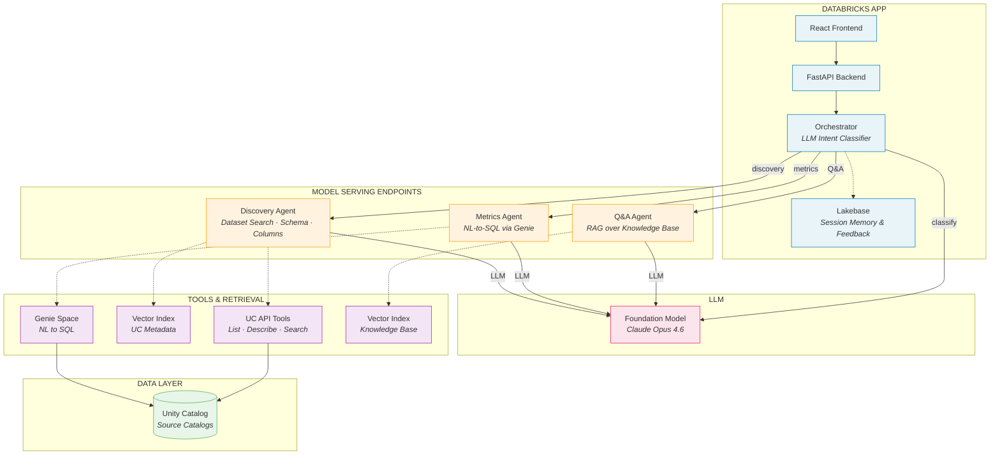

# UC Data Advisor

A multi-agent system that enables natural language dataset discovery over Unity Catalog. Deploys as a Databricks App with agents running on individual Model Serving endpoints.

## Architecture



## Components

| Layer | Component | Purpose |
|-------|-----------|---------|
| **App** | Orchestrator | LLM intent classifier that routes to sub-agents |
| **App** | Lakebase | Session memory and user feedback storage |
| **Model Serving** | Discovery Agent | Find datasets by name, schema, description via UC API + Vector Search |
| **Model Serving** | Metrics Agent | Answer analytical questions via Genie Space (NL-to-SQL) |
| **Model Serving** | Q&A Agent | RAG over governance FAQs and knowledge base |
| **LLM** | Foundation Model | Pay-per-token model for all inference (classification + agent reasoning) |
| **Tools** | UC API, Vector Search, Genie | Metadata access, semantic search, SQL generation |

## Key Design Decisions

- **Agents on Model Serving**: Each agent runs on its own endpoint with scale-to-zero, enabling independent scaling and versioning
- **Orchestrator in App**: Lightweight classifier stays in the FastAPI app (no heavy compute, manages sessions)
- **OAuth M2M for agents**: Auto-created SP with secrets in Databricks secret scope for outbound API calls from Model Serving containers
- **Catalog scoping**: Agents only see catalogs listed in `source_catalogs` config via `SOURCE_CATALOGS` env var
- **MLflow ResponsesAgent**: All agents extend `mlflow.pyfunc.ResponsesAgent` for built-in tracing and model registry

## Quick Start

```bash
git clone https://github.com/guanjieshen/uc-data-advisor.git
cd uc-data-advisor
cp config/advisor_config.example.yaml config/my_config.yaml
# Edit my_config.yaml with your catalogs and workspace
uv run python -m src.setup.run --config config/my_config.yaml
```

See [DEPLOYMENT.md](DEPLOYMENT.md) for full deployment guide, config reference, benchmarks, and troubleshooting.

## Project Structure

```
app/                          # Databricks App (deployed to workspace)
  server/
    agents/
      base.py                 # ResponsesBaseAgent with tool-calling loop
      orchestrator.py         # Intent classifier + RemoteAgentClient
      discovery.py            # UC metadata discovery agent
      metrics.py              # Genie Space metrics agent
      qa.py                   # Knowledge base Q&A agent
    tools/                    # UC API, Genie, Vector Search tool implementations
    routes/                   # FastAPI routes (chat, feedback, health)
    config.py                 # Auth chain (App SP, OAuth M2M, CLI)
    advisor_config.py         # Runtime config loader
  ui/                         # React frontend
src/
  setup/
    run.py                    # Pipeline orchestrator (9 steps + teardown)
    provision_infrastructure.py  # Creates all Databricks resources
    audit_metadata.py         # Walks UC catalogs for metadata
    generate_*.py             # Content generation (prompts, KB, benchmarks)
    register_models.py        # MLflow model registration (parallel)
    deploy_agent_endpoints.py # Agent Bricks deployment (parallel)
    deploy.py                 # Artifact + app deployment
    teardown.py               # Full resource cleanup
config/
  advisor_config.example.yaml # Template config
tests/
  benchmark.py               # CLI benchmark script
  benchmark_notebook.py       # Databricks notebook benchmark
```
