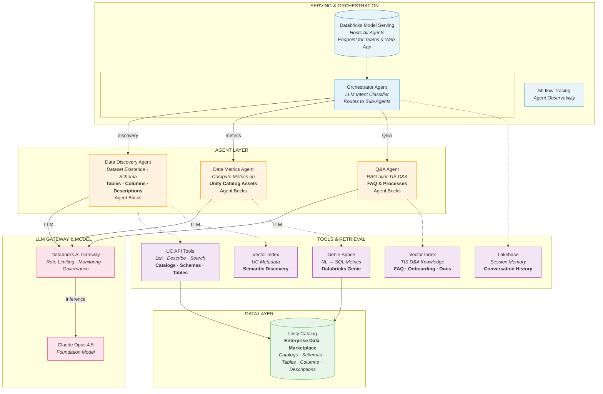

# UC Data Advisor

A multi-agent system that enables natural language dataset discovery over Unity Catalog.

## Architecture

## Components

| Layer | Component | Purpose |
|-------|-----------|---------|
| **Orchestration** | Orchestrator Agent | Routes queries to specialized sub-agents |
| **Agents** | Data Discovery | Find datasets by name, schema, description |
| **Agents** | Data Metrics | Compute metrics via Genie SQL generation |
| **Agents** | Q&A | RAG over documentation and FAQ |
| **LLM** | AI Gateway + Claude | Rate limiting, monitoring, inference |
| **Tools** | UC API, Vector Search, Genie, Lakebase | Metadata access, semantic search, session memory |

## Getting Started

See [docs/architecture.md](docs/architecture.md) for detailed component information.

## License

See LICENSE file for details.
