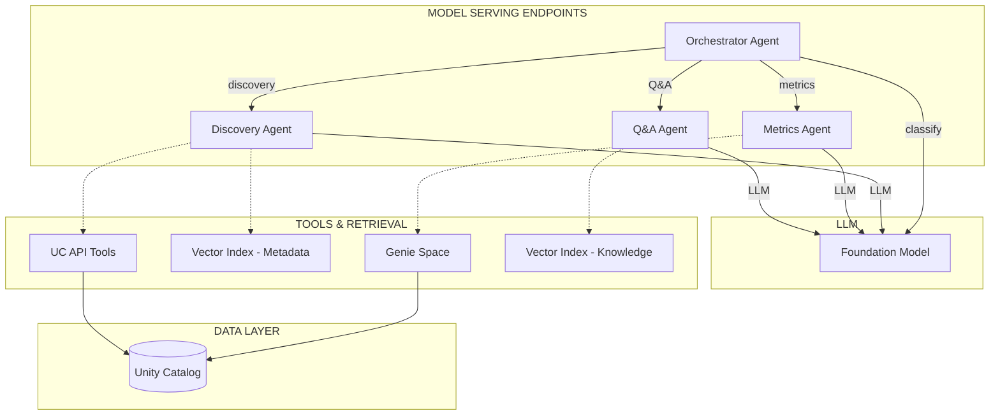

# UC Data Advisor

A multi-agent system that enables natural language dataset discovery over Unity Catalog. Deploys entirely on Databricks Model Serving — no app required.

## Architecture



## Components

| Layer | Component | Purpose |
|-------|-----------|---------|
| **Model Serving** | Orchestrator Agent | LLM intent classifier that routes to sub-agents |
| **Model Serving** | Discovery Agent | Find datasets, volumes, tags, lineage, constraints via VS metadata index |
| **Model Serving** | Metrics Agent | Answer analytical questions via Genie Space (NL-to-SQL) |
| **Model Serving** | Q&A Agent | RAG over governance FAQs and knowledge base |
| **LLM** | Foundation Model | Pay-per-token model for all inference |
| **Tools** | Vector Search, Genie | Metadata semantic search, NL-to-SQL |

## Key Design Decisions

- **System tables for metadata**: Setup queries `system.information_schema` for enriched metadata (columns, tags, constraints, lineage, privileges, volumes) and populates a Vector Search index
- **VS index at runtime, no SQL**: Agents query the pre-built VS index — no SQL warehouse needed at runtime, sub-second responses
- **All agents on Model Serving**: Each agent (including orchestrator) runs on its own endpoint with scale-to-zero
- **Single entry point**: The orchestrator endpoint handles classification + routing — callable from Teams, notebooks, or any HTTP client
- **User-provided SP**: A single service principal configured in YAML receives all grants and authenticates Model Serving containers via OAuth M2M
- **Cross-cloud**: Works on both AWS and Azure Databricks workspaces

## Quick Start

```bash
git clone https://github.com/guanjieshen/uc-data-advisor.git
cd uc-data-advisor
cp config/advisor_config.example.yaml config/my_config.yaml
# Edit my_config.yaml with your catalogs, workspace, and service principal
uv run python -m src.setup.run --config config/my_config.yaml
```

See [DEPLOYMENT.md](DEPLOYMENT.md) for full deployment guide, config reference, benchmarks, and troubleshooting.

## Project Structure

```
app/
  server/
    agents/
      base.py                   # ResponsesBaseAgent with tool-calling loop
      orchestrator_agent.py     # Orchestrator (classify + route) for Model Serving
      discovery.py              # UC metadata discovery agent
      metrics.py                # Genie Space metrics agent
      qa.py                     # Knowledge base Q&A agent
    tools/                      # Genie, Vector Search tool implementations
    config.py                   # Auth chain (Model Serving OAuth M2M, CLI)
    advisor_config.py           # Runtime config loader
    uc_tools.py                 # VS-based metadata search (no runtime SQL)
src/
  setup/
    run.py                      # Pipeline orchestrator (8 steps + teardown)
    provision_infrastructure.py # Creates catalog, VS endpoint, Genie, SP secrets
    audit_metadata.py           # Walks UC catalogs for metadata
    generate_*.py               # Content generation (prompts, KB, benchmarks)
    register_models.py          # MLflow model registration (parallel)
    deploy_agent_endpoints.py   # Agent Bricks deployment (parallel)
    deploy.py                   # Delta tables, VS indexes, Genie config
    teardown.py                 # Full resource cleanup
config/
  advisor_config.example.yaml   # Template config
teams/                          # Microsoft Teams bot integration
tests/
  benchmark.py                  # CLI benchmark script
  benchmark_notebook.py         # Databricks notebook benchmark
```
