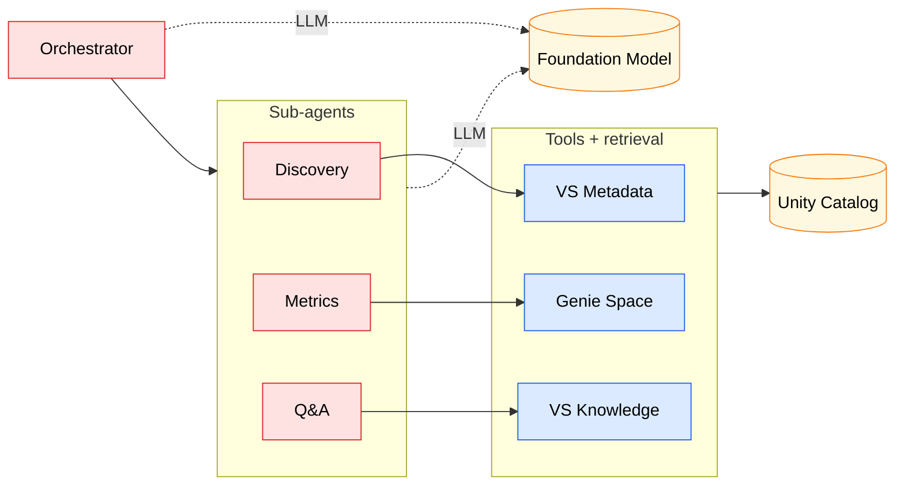
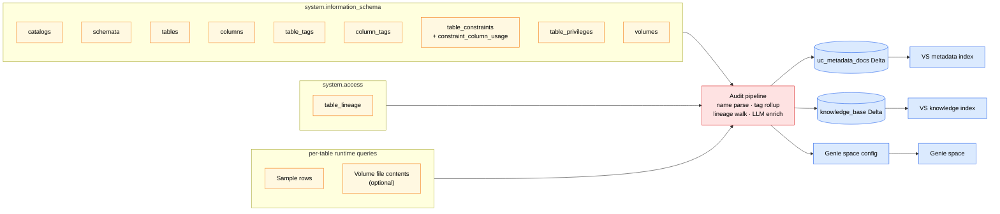

# UC Data Advisor

A multi-agent system that enables natural language dataset discovery over Unity Catalog. Deploys entirely on Databricks Model Serving — no app required.

## Architecture


```mermaid
flowchart LR
  ORCH[Orchestrator]

  subgraph AGENTS["Sub-agents"]
    direction TB
    DA[Discovery]
    DM[Metrics]
    QA[Q&A]
  end

  subgraph TOOLS["Tools + retrieval"]
    direction TB
    VS1[VS Metadata]
    GENIE[Genie Space]
    VS2[VS Knowledge]
  end

  UCat[(Unity Catalog)]
  CLAUDE[(Foundation Model)]

  ORCH --> AGENTS
  DA --> VS1
  DM --> GENIE
  QA --> VS2
  TOOLS --> UCat

  ORCH -.->|LLM| CLAUDE
  AGENTS -.->|LLM| CLAUDE

  classDef ep fill:#fee2e2,stroke:#dc2626,color:#000
  classDef tool fill:#dbeafe,stroke:#2563eb,color:#000
  classDef store fill:#fff8e1,stroke:#f57f17,color:#000
  class ORCH,DA,DM,QA ep
  class VS1,GENIE,VS2 tool
  class UCat,CLAUDE store
```

## Metadata Sources

Everything the agents know about Unity Catalog comes from a one-shot audit pipeline that
reads system tables (read-only) and a small amount of per-table runtime sampling. No SQL
runs at agent query time — answers come from the persisted Delta tables and the Vector
Search / Genie indexes built from them.


```mermaid
flowchart LR
  subgraph IS["system.information_schema"]
    direction TB
    CAT[catalogs]
    SCH[schemata]
    TBL[tables]
    COL[columns]
    TTAG[table_tags]
    CTAG[column_tags]
    CONS["table_constraints<br/>+ constraint_column_usage"]
    PRIV[table_privileges]
    VOL[volumes]
  end

  subgraph SA["system.access"]
    LIN[table_lineage]
  end

  subgraph RT["per-table runtime queries"]
    direction TB
    SAMP[Sample rows]
    VFILES["Volume file contents<br/>(optional)"]
  end

  AUDIT["Audit pipeline<br/>name parse · tag rollup<br/>lineage walk · LLM enrich"]

  MDOC[(uc_metadata_docs Delta)]
  KB[(knowledge_base Delta)]
  GZ[Genie space config]

  VSM[VS metadata index]
  VSK[VS knowledge index]
  GSP[Genie space]

  IS --> AUDIT
  SA --> AUDIT
  RT --> AUDIT
  AUDIT --> MDOC
  AUDIT --> KB
  AUDIT --> GZ
  MDOC --> VSM
  KB --> VSK
  GZ --> GSP

  classDef src fill:#fff8e1,stroke:#f57f17,color:#000
  classDef proc fill:#fee2e2,stroke:#dc2626,color:#000
  classDef store fill:#dbeafe,stroke:#2563eb,color:#000
  class CAT,SCH,TBL,COL,TTAG,CTAG,CONS,PRIV,VOL,LIN,SAMP,VFILES src
  class AUDIT proc
  class MDOC,KB,GZ,VSM,VSK,GSP store
```

| Source | What it gives the agents |
|--------|---------------------------|
| `system.information_schema.catalogs` / `schemata` | Catalog + schema names, owners, comments |
| `system.information_schema.tables` | Table names, types, owners, comments, timestamps |
| `system.information_schema.columns` | Column names, types, nullability, ordinal position |
| `system.information_schema.table_tags` / `column_tags` | Curated business tags at table + column scope |
| `system.information_schema.table_constraints` + `constraint_column_usage` | Primary / foreign / unique keys for join hints |
| `system.information_schema.table_privileges` | Grants — used to infer who uses what |
| `system.information_schema.volumes` | UC volumes (paths, owners, comments) |
| `system.access.table_lineage` | Upstream / downstream table edges (best-effort) |
| Per-table sample SQL | A few sample rows per table for value-level context |
| Volume file contents (opt-in) | Text from files inside indexed volumes |

## Components

| Layer | Component | Purpose |
|-------|-----------|---------|
| **Model Serving** | Orchestrator Agent | LLM intent classifier that routes to sub-agents |
| **Model Serving** | Discovery Agent | Find datasets, volumes, tags, lineage, constraints via VS metadata index |
| **Model Serving** | Metrics Agent | Answer analytical questions via Genie Space (NL-to-SQL) |
| **Model Serving** | Q&A Agent | RAG over governance FAQs and knowledge base |
| **LLM** | Foundation Model | Pay-per-token model for all inference |
| **Tools** | Vector Search, Genie | Metadata semantic search, NL-to-SQL |

## Key Design Decisions

- **System tables for metadata**: Setup queries `system.information_schema` for enriched metadata (columns, tags, constraints, lineage, privileges, volumes) and populates a Vector Search index
- **VS index at runtime, no SQL**: Agents query the pre-built VS index — no SQL warehouse needed at runtime, sub-second responses
- **All agents on Model Serving**: Each agent (including orchestrator) runs on its own endpoint with scale-to-zero
- **Single entry point**: The orchestrator endpoint handles classification + routing — callable from Teams, notebooks, or any HTTP client
- **User-provided SP**: A single service principal configured in YAML receives all grants and authenticates Model Serving containers via OAuth M2M
- **Cross-cloud**: Works on both AWS and Azure Databricks workspaces

## Quick Start

```bash
git clone https://github.com/guanjieshen/uc-data-advisor.git
cd uc-data-advisor
cp config/advisor_config.example.yaml config/my_config.yaml
# Edit my_config.yaml with your catalogs, workspace, and service principal
uv run python -m src.setup.run --config config/my_config.yaml
```

The pipeline keeps user-authored config and pipeline-generated state in separate files (`<name>_config.yaml` + `<name>_config.generated.yaml`). You only ever edit the input file.

- See [DEPLOYMENT.md](DEPLOYMENT.md) for the full deployment guide, config reference, benchmarks, and troubleshooting.
- See [teams/README.md](teams/README.md) for Microsoft Teams integration (two patterns: public workspace + fully-private with Private Link / NCC).
- See [teams/ARCHITECTURE.md](teams/ARCHITECTURE.md) for detailed bot architecture diagrams.

## Project Structure

```
app/
  server/
    agents/
      base.py                   # ResponsesBaseAgent with tool-calling loop
      orchestrator_agent.py     # Orchestrator (classify + route) for Model Serving
      discovery.py              # UC metadata discovery agent
      metrics.py                # Genie Space metrics agent
      qa.py                     # Knowledge base Q&A agent
    tools/                      # Genie, Vector Search tool implementations
    config.py                   # Auth chain (Model Serving OAuth M2M, CLI)
    advisor_config.py           # Runtime config loader
    uc_tools.py                 # VS-based metadata search (no runtime SQL)
src/
  setup/
    run.py                      # Pipeline orchestrator (8 steps + teardown)
    config_loader.py            # Two-file config (input + .generated sibling)
    provision_infrastructure.py # Creates catalog, VS endpoint, Genie, SP secrets
    audit_metadata.py           # Walks UC catalogs for metadata
    generate_*.py               # Content generation (prompts, KB, benchmarks)
    register_models.py          # MLflow model registration (parallel)
    deploy_agent_endpoints.py   # Model Serving endpoint creation (sub-agents parallel, orchestrator sequential)
    deploy.py                   # Delta tables, VS indexes, Genie config
    teardown.py                 # Full resource cleanup
config/
  advisor_config.example.yaml   # Template config (input half)
teams/
  README.md                     # Teams bot: 2 deployment patterns
  ARCHITECTURE.md               # Detailed bot architecture (Mermaid)
  ARCHITECTURE.html             # Same content as a brand-styled HTML deck
  deploy.py                     # Bot Azure deploy (Web App, Bot Service, optional VNet)
  teams_config.example.yaml     # Bot config template
tests/
  benchmark.py                  # CLI benchmark script
  benchmark_notebook.py         # Databricks notebook benchmark
```
