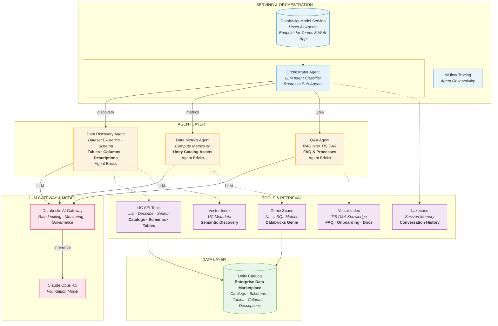

# UC Data Advisor Architecture

## Overview

The UC Data Advisor is a multi-agent system that enables natural language dataset discovery over Unity Catalog. It uses an orchestrator pattern to route queries to specialized sub-agents.

## Architecture Diagram

## Component Details

### Serving & Orchestration

| Component | Description |
|-----------|-------------|
| **Databricks Model Serving** | Hosts all agent endpoints, provides interface for Teams and Web App |
| **MLflow Tracing** | Observability for agent execution, latency tracking, debugging |
| **Orchestrator Agent** | LLM-based intent classifier that routes queries to specialized sub-agents |

### Agent Layer

| Agent | Purpose | Capabilities |
|-------|---------|--------------|
| **Data Discovery Agent** | Find datasets by name, schema, description | Tables, Columns, Descriptions |
| **Data Metrics Agent** | Compute metrics on UC assets | SQL generation via Genie |
| **Q&A Agent** | Answer questions from documentation | RAG over FAQ & processes |

All agents are built using **Databricks Agent Bricks**.

### LLM Gateway & Model

| Component | Description |
|-----------|-------------|
| **Databricks AI Gateway** | Rate limiting, monitoring, governance |
| **Claude Opus 4.5** | Foundation model for inference |

### Tools & Retrieval

| Tool | Used By | Purpose |
|------|---------|---------|
| **UC API Tools** | Data Discovery | List, describe, search catalogs/schemas/tables |
| **Vector Index (UC)** | Data Discovery | Semantic search over UC metadata |
| **Genie Space** | Data Metrics | Natural language to SQL conversion |
| **Lakebase** | Orchestrator | Session memory, conversation history |
| **Vector Index (Docs)** | Q&A Agent | RAG over FAQ, onboarding, documentation |

### Data Layer

| Component | Description |
|-----------|-------------|
| **Unity Catalog** | Enterprise data marketplace with catalogs, schemas, tables, columns, descriptions |

## Data Flow

1. User query arrives at **Databricks Model Serving**
2. **Orchestrator Agent** classifies intent and routes to appropriate sub-agent
3. Sub-agent uses **LLM** (via AI Gateway) and **Tools** to process query
4. Results returned through the serving endpoint
5. All interactions traced via **MLflow Tracing**

## Legend

| Color | Category |
|-------|----------|
| Blue | Discovery |
| Orange | Metrics |
| Purple | Q&A / RAG |
| Teal | Gateway / Orchestration |
| Yellow | Foundation Model |
| Green | Genie |
| Dark Blue | Agent Bricks |
| Gray | Session / Observability |
