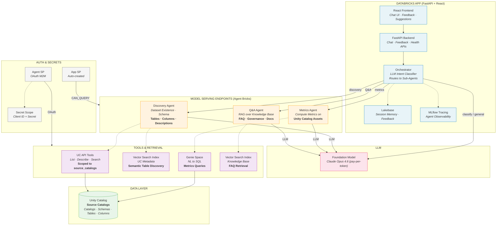

# UC Data Advisor Architecture

## Overview

The UC Data Advisor is a multi-agent system for natural language dataset discovery over Unity Catalog. It deploys as a Databricks App with a React frontend and FastAPI backend. The orchestrator classifies user intent and routes to specialized agents running on individual Model Serving endpoints.

## Architecture Diagram



## Component Details

### Databricks App

| Component | Description |
|-----------|-------------|
| **React Frontend** | Chat interface with message history, thumbs up/down feedback, and landing page suggestions |
| **FastAPI Backend** | `/api/chat`, `/api/feedback`, `/api/health`, `/api/ui-config` endpoints |
| **Orchestrator** | Single LLM call to classify intent (discovery/metrics/qa/general), then routes to the matching agent endpoint via HTTP |
| **Lakebase** | PostgreSQL-compatible database for session history and user feedback |
| **MLflow Tracing** | Automatic trace logging for orchestrator classification and agent calls |

### Model Serving Endpoints

Each agent is registered as an MLflow model in Unity Catalog and deployed to its own Model Serving endpoint via the Agent Bricks SDK.

| Agent | MLflow Class | Tools | Data Source |
|-------|-------------|-------|-------------|
| **Discovery** | `DiscoveryAgent` | `list_catalogs`, `list_schemas`, `list_tables`, `get_table_details`, `search_tables`, `semantic_search_tables` | UC API + VS metadata index |
| **Metrics** | `MetricsAgent` | `query_genie` | Genie Space (NL-to-SQL) |
| **Q&A** | `QAAgent` | `search_knowledge_base` | VS knowledge base index |

Endpoint properties:
- **Scale to zero** when idle (cost-efficient)
- **OAuth M2M** authentication via secret scope references (`{{secrets/scope/key}}`)
- **Environment variables**: `DATABRICKS_HOST`, `DATABRICKS_CLIENT_ID`, `DATABRICKS_CLIENT_SECRET`, `SERVING_ENDPOINT`, `GENIE_SPACE_ID`, `VS_INDEX_METADATA`, `VS_INDEX_KNOWLEDGE`, `SOURCE_CATALOGS`

### Authentication

| SP | Created By | Used For |
|----|-----------|----------|
| **App SP** | Databricks (auto-created with app) | App runtime — calls agent endpoints, Lakebase, LLM endpoint |
| **Agent SP** | Setup pipeline (deployer-owned) | Model Serving outbound calls — UC API, VS, Genie, LLM |

The agent SP:
- Gets `workspace-access` entitlement via SCIM
- Has an OAuth secret generated via `service_principal_secrets_proxy`
- Credentials stored in a Databricks secret scope
- Referenced by endpoints as `{{secrets/{scope}/sp-client-id}}` and `{{secrets/{scope}/sp-client-secret}}`

Both SPs receive identical UC, warehouse, Genie, Lakebase, and endpoint grants.

### Tools & Retrieval

| Tool | Used By | Implementation |
|------|---------|----------------|
| **UC API Tools** | Discovery | Databricks SDK — `catalogs.list()`, `schemas.list()`, `tables.list()`, `tables.get()`. Scoped to `SOURCE_CATALOGS` env var |
| **VS Metadata Index** | Discovery | Delta Sync Vector Search index over `uc_metadata_docs` table. Embedding model: `databricks-bge-large-en` |
| **Genie Space** | Metrics | REST API — starts conversation, polls for SQL results. Warehouse executes generated SQL |
| **VS Knowledge Index** | Q&A | Delta Sync Vector Search index over `knowledge_base` table. Auto-generated governance FAQs |
| **Lakebase** | Orchestrator | `asyncpg` connection to Lakebase PostgreSQL instance for session history and feedback |

## Data Flow

1. User sends a message via the React chat UI
2. FastAPI routes to the **Orchestrator**, which loads session history from Lakebase
3. Orchestrator makes a single LLM call to classify intent: `discovery`, `metrics`, `qa`, or `general`
4. For `general`: orchestrator responds directly via LLM (no agent call)
5. For agent intents: orchestrator calls the agent's Model Serving endpoint via `/serving-endpoints/{name}/invocations`
6. Agent uses its tools (UC API, Genie, VS) and LLM to produce a response
7. Response returned to user; exchange saved to Lakebase for session continuity

## Setup Pipeline

The setup pipeline (`src/setup/run.py`) automates all infrastructure creation and content generation:

```
provision → grant-uc → audit → generate → register → deploy-agents → grant-agent-permissions → deploy
```

| Step | What It Does |
|------|-------------|
| `provision` | Creates warehouse, catalog, VS endpoint, app, Lakebase, Genie space, agent SP + secrets |
| `grant-uc` | Grants UC, warehouse, and Genie permissions to both SPs |
| `audit` | Walks source catalogs to collect metadata |
| `generate` | Generates prompts, knowledge base, benchmarks, UI config |
| `register` | Registers 3 agent MLflow models in UC (parallel) |
| `deploy-agents` | Deploys 3 Model Serving endpoints via Agent Bricks (parallel) |
| `grant-agent-permissions` | Grants `CAN_QUERY` on agent endpoints to app SP |
| `deploy` | Writes Delta tables, VS indexes, Genie config, deploys app |
| `verify` | Runs 8 benchmark questions against the live deployment |
| `teardown` | Deletes all 9 resource types in order |
