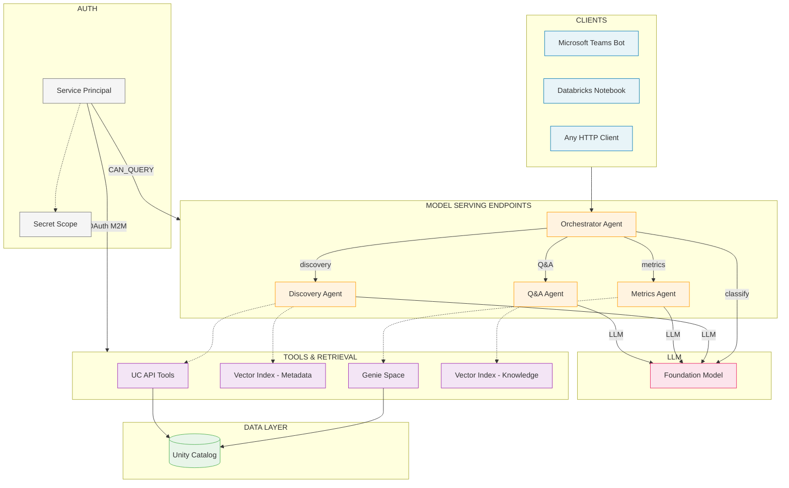

# UC Data Advisor Architecture

## Overview

The UC Data Advisor is a multi-agent system for natural language dataset discovery over Unity Catalog. All agents — including the orchestrator — run on individual Databricks Model Serving endpoints. No Databricks App is required. The orchestrator endpoint is the single entry point, callable from Teams, notebooks, or any HTTP client.

## Architecture Diagram



## Component Details

### Model Serving Endpoints

All agents are registered as MLflow models in Unity Catalog and deployed to individual Model Serving endpoints via the Agent Bricks SDK.

| Agent | MLflow Class | Tools | Data Source |
|-------|-------------|-------|-------------|
| **Orchestrator** | `OrchestratorAgent` | None (routes to sub-agents) | LLM for classification |
| **Discovery** | `DiscoveryAgent` | `list_catalogs`, `list_schemas`, `list_tables`, `get_table_details`, `search_tables`, `semantic_search_tables` | UC API + VS metadata index |
| **Metrics** | `MetricsAgent` | `query_genie` | Genie Space (NL-to-SQL) |
| **Q&A** | `QAAgent` | `search_knowledge_base` | VS knowledge base index |

Endpoint properties:
- **Scale to zero** when idle
- **OAuth M2M** authentication via SP credentials injected as env vars at deploy time
- **Environment variables**: `DATABRICKS_HOST`, `DATABRICKS_CLIENT_ID`, `DATABRICKS_CLIENT_SECRET`, `SERVING_ENDPOINT`, `GENIE_SPACE_ID`, `VS_INDEX_METADATA`, `VS_INDEX_KNOWLEDGE`, `SOURCE_CATALOGS`
- **Orchestrator** also gets: `DISCOVERY_AGENT_ENDPOINT`, `METRICS_AGENT_ENDPOINT`, `QA_AGENT_ENDPOINT`

### Authentication

A single user-provided service principal handles all auth:

| What | Permission |
|------|-----------|
| **UC catalogs** | `USE CATALOG` + `SELECT` on source, `ALL PRIVILEGES` on advisor |
| **SQL warehouse** | `CAN_USE` |
| **Genie Space** | `CAN_RUN` |
| **Agent endpoints** | `CAN_QUERY` |
| **Model Serving outbound** | OAuth M2M via `DATABRICKS_CLIENT_ID` + `DATABRICKS_CLIENT_SECRET` |

The SP's OAuth secret is:
1. Generated via `service_principal_secrets_proxy.create()`
2. Stored in a Databricks secret scope
3. Read from the scope at deploy time by the pipeline
4. Injected as env vars into serving endpoints

### Tools & Retrieval

| Tool | Used By | Implementation |
|------|---------|----------------|
| **UC API Tools** | Discovery | Databricks SDK — `catalogs.list()`, `schemas.list()`, `tables.list()`, `tables.get()`. Scoped to `SOURCE_CATALOGS` env var |
| **VS Metadata Index** | Discovery | Delta Sync Vector Search index over `uc_metadata_docs` table |
| **Genie Space** | Metrics | REST API — starts conversation, polls for SQL results |
| **VS Knowledge Index** | Q&A | Delta Sync Vector Search index over `knowledge_base` table |

## Data Flow

1. Client sends a message to the **orchestrator endpoint** via `/serving-endpoints/{name}/invocations`
2. Orchestrator makes a single LLM call to classify intent: `discovery`, `metrics`, `qa`, or `general`
3. For `general`: orchestrator responds directly via LLM
4. For agent intents: orchestrator calls the sub-agent endpoint via HTTP
5. Sub-agent uses its tools (UC API, Genie, VS) and LLM to produce a response
6. Response returned to client

## Setup Pipeline

The setup pipeline (`src/setup/run.py`) automates all infrastructure creation and content generation:

```
provision → grant-uc → audit → generate → register → deploy-agents → grant-agent-permissions → deploy
```

| Step | What It Does |
|------|-------------|
| `provision` | Creates catalog, VS endpoint, Genie space, SP OAuth secret in scope |
| `grant-uc` | Grants UC, warehouse, and Genie permissions to SP |
| `audit` | Walks source catalogs to collect metadata |
| `generate` | Generates prompts, knowledge base, benchmarks |
| `register` | Registers 4 agent MLflow models in UC (parallel) |
| `deploy-agents` | Deploys 4 Model Serving endpoints via Agent Bricks (sub-agents parallel, orchestrator sequential) |
| `grant-agent-permissions` | Grants `CAN_QUERY` on all endpoints to SP |
| `deploy` | Writes Delta tables, VS indexes, Genie config |
| `verify` | Runs 8 benchmark questions (run separately) |
| `teardown` | Deletes all 6 resource types |
