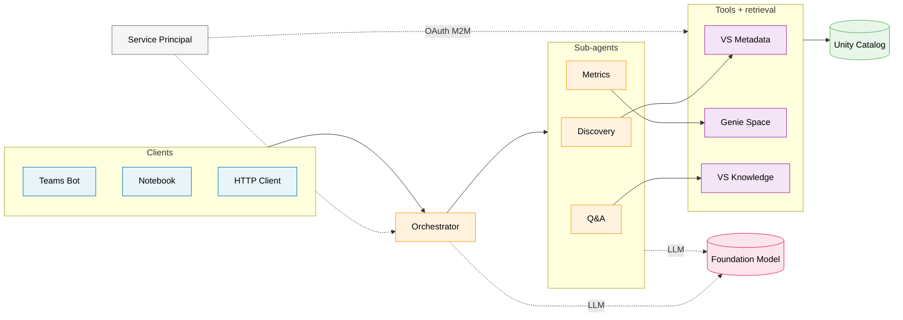
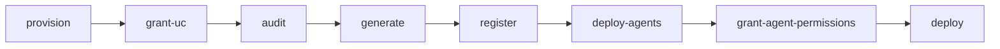

# UC Data Advisor Architecture

## Overview

The UC Data Advisor is a multi-agent system for natural language dataset discovery over Unity Catalog. All agents — including the orchestrator — run on individual Databricks Model Serving endpoints. No Databricks App is required. The orchestrator endpoint is the single entry point, callable from Teams, notebooks, or any HTTP client.

## Architecture Diagram

```mermaid
flowchart LR
  subgraph CLIENTS["Clients"]
    direction TB
    TEAMS[Teams Bot]
    NB[Notebook]
    HTTP[HTTP Client]
  end

  ORCH[Orchestrator]

  subgraph AGENTS["Sub-agents"]
    direction TB
    DA[Discovery]
    DM[Metrics]
    QA[Q&A]
  end

  subgraph TOOLS["Tools + retrieval"]
    direction TB
    VS1[VS Metadata]
    GENIE[Genie Space]
    VS2[VS Knowledge]
  end

  UCat[(Unity Catalog)]
  CLAUDE[(Foundation Model)]

  CLIENTS --> ORCH --> AGENTS
  DA --> VS1
  DM --> GENIE
  QA --> VS2
  TOOLS --> UCat

  ORCH -.->|LLM| CLAUDE
  AGENTS -.->|LLM| CLAUDE

  SP[Service Principal] -.->|CAN_QUERY| ORCH
  SP -.->|OAuth M2M| TOOLS

  classDef ep fill:#fff3e0,stroke:#ff9800,color:#000
  classDef tool fill:#f3e5f5,stroke:#9c27b0,color:#000
  classDef store fill:#e8f5e9,stroke:#4caf50,color:#000
  classDef llm fill:#fce4ec,stroke:#e91e63,color:#000
  classDef auth fill:#f5f5f5,stroke:#757575,color:#000
  classDef client fill:#e8f4f8,stroke:#0077b6,color:#000
  class ORCH,DA,DM,QA ep
  class VS1,GENIE,VS2 tool
  class UCat store
  class CLAUDE llm
  class SP auth
  class TEAMS,NB,HTTP client
```

## Component Details

### Model Serving Endpoints

All agents are registered as MLflow models in Unity Catalog and deployed to individual Model Serving endpoints via the Agent Bricks SDK.

| Agent | MLflow Class | Tools | Data Source |
|-------|-------------|-------|-------------|
| **Orchestrator** | `OrchestratorAgent` | None (routes to sub-agents) | LLM for classification |
| **Discovery** | `DiscoveryAgent` | `search_metadata`, `semantic_search_tables` | VS metadata index (tables, volumes, tags, constraints, lineage, privileges) |
| **Metrics** | `MetricsAgent` | `query_genie` | Genie Space (NL-to-SQL) |
| **Q&A** | `QAAgent` | `search_knowledge_base` | VS knowledge base index |

Discovery uses the VS metadata index exclusively — no runtime SQL queries. The index is populated at setup time from `system.information_schema` and `system.access` system tables.

Endpoint properties:
- **Scale to zero** when idle
- **OAuth M2M** authentication via SP credentials resolved at runtime from secret-scope references in env vars (`{{secrets/<scope>/sp-client-id}}` / `{{secrets/<scope>/sp-client-secret}}`)
- **Environment variables**: `DATABRICKS_HOST`, `DATABRICKS_CLIENT_ID`, `DATABRICKS_CLIENT_SECRET`, `SERVING_ENDPOINT`, `GENIE_SPACE_ID`, `VS_INDEX_METADATA`, `VS_INDEX_KNOWLEDGE`, `SOURCE_CATALOGS`
- **Orchestrator** also gets: `DISCOVERY_AGENT_ENDPOINT`, `METRICS_AGENT_ENDPOINT`, `QA_AGENT_ENDPOINT`
- **Scale-to-zero**: on by default; flip via `scale_to_zero: false` in config to keep endpoints warm

### Authentication

A single user-provided service principal handles all auth:

| What | Permission |
|------|-----------|
| **UC catalogs** | `USE CATALOG` + `SELECT` on source, `ALL PRIVILEGES` on advisor |
| **System tables** | `USE SCHEMA` + `SELECT` on `system.information_schema` and `system.access` |
| **SQL warehouse** | `CAN_USE` |
| **Genie Space** | `CAN_RUN` |
| **Agent endpoints** | `CAN_QUERY` |
| **Model Serving outbound** | OAuth M2M via `DATABRICKS_CLIENT_ID` + `DATABRICKS_CLIENT_SECRET` |

The SP's OAuth secret is:
1. Generated via `service_principal_secrets_proxy.create()`
2. Stored in a Databricks secret scope
3. Read from the scope at deploy time by the pipeline
4. Injected as env vars into serving endpoints

### Tools & Retrieval

| Tool | Used By | Implementation |
|------|---------|----------------|
| **VS Metadata Index** | Discovery | Delta Sync VS index over `uc_metadata_docs` — contains tables, volumes, columns, tags, constraints, lineage, privileges. Populated from `system.information_schema` at setup time |
| **Genie Space** | Metrics | REST API — NL-to-SQL, starts conversation, polls for SQL results |
| **VS Knowledge Index** | Q&A | Delta Sync VS index over `knowledge_base` — governance FAQs |

No runtime SQL queries — all metadata discovery goes through Vector Search.

## Data Flow

1. Client sends a message to the **orchestrator endpoint** via `/serving-endpoints/{name}/invocations`
2. Orchestrator makes a single LLM call to classify intent: `discovery`, `metrics`, `qa`, or `general`
3. For `general`: orchestrator responds directly via LLM
4. For agent intents: orchestrator calls the sub-agent endpoint via HTTP
5. Discovery agent searches the VS metadata index; Metrics agent queries Genie; QA searches VS knowledge base
6. Response returned to client

## Setup Pipeline

The setup pipeline (`src/setup/run.py`) automates all infrastructure creation and content generation:

```mermaid
flowchart LR
  P[provision] --> G[grant-uc] --> A[audit] --> GEN[generate] --> R[register] --> DA[deploy-agents] --> GA[grant-agent-permissions] --> D[deploy]
```

| Step | What It Does |
|------|-------------|
| `provision` | Creates catalog, VS endpoint, Genie space, SP OAuth secret in scope |
| `grant-uc` | Grants UC, system tables, warehouse, and Genie permissions to SP |
| `audit` | Queries system.information_schema for enriched metadata (tags, constraints, lineage, privileges, volumes) |
| `generate` | Generates prompts, knowledge base, benchmarks |
| `register` | Registers 4 agent MLflow models in UC (parallel) |
| `deploy-agents` | Deploys 4 Model Serving endpoints via the Databricks SDK (sub-agents parallel, orchestrator sequential) |
| `grant-agent-permissions` | Grants `CAN_QUERY` on all endpoints to SP |
| `deploy` | Writes Delta tables, VS indexes, Genie config |
| `verify` | Runs 8 benchmark questions (run separately) |
| `teardown` | Deletes all 6 resource types |
