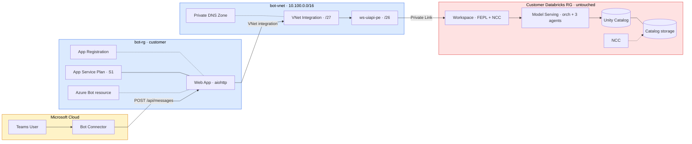
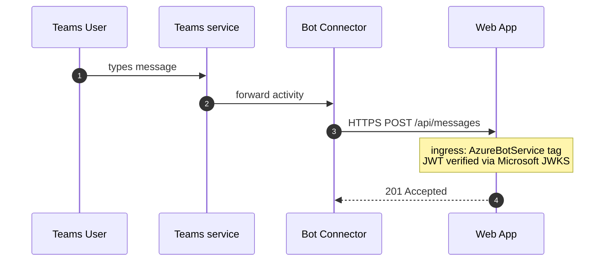
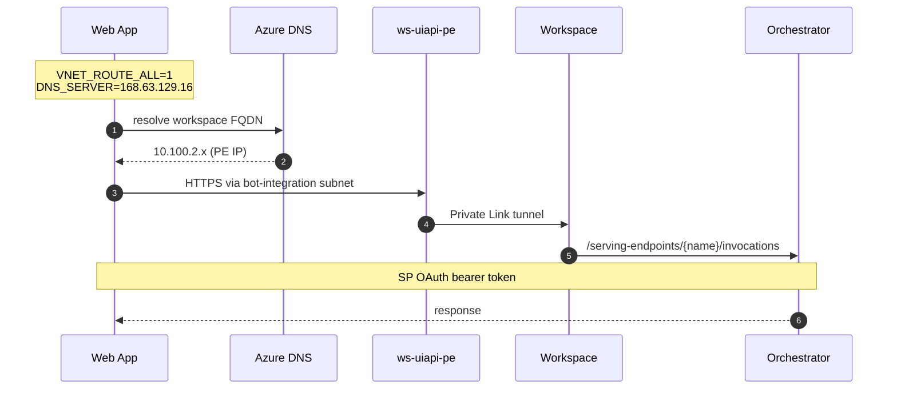
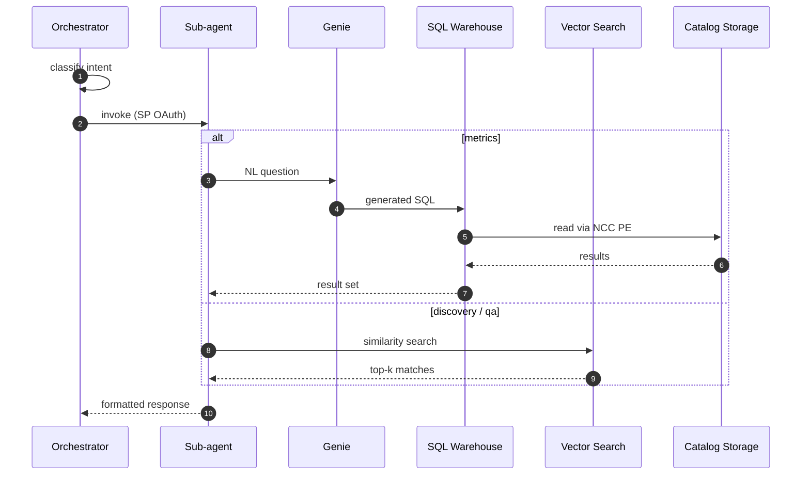
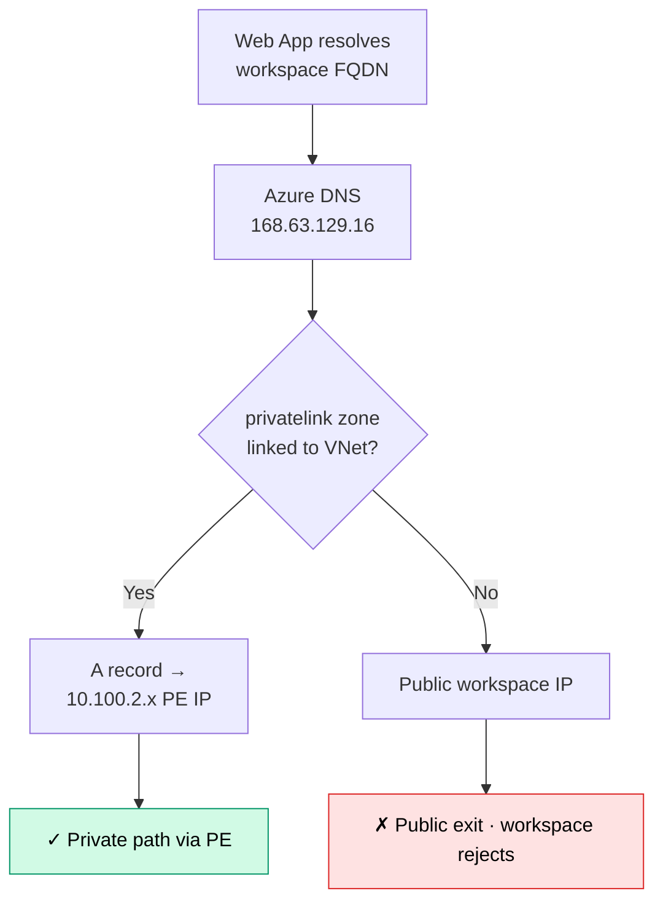

# Teams Bot — Detailed Architecture (Pattern B)

This document covers the **fully-isolated bot RG** deployment pattern, where the bot lives in its own RG/VNet and reaches a private-link-only Databricks workspace via its own Private Endpoint. For the simpler public-workspace pattern, see [README.md](README.md#pattern-a--public-workspace).

Three layers covered below:
1. **Resource topology** — what exists and where it lives
2. **Network paths** — how each request traverses the topology
3. **Component importance** — what each resource does and what fails without it

> **Also available as a brand-styled HTML deck**: [`ARCHITECTURE.html`](ARCHITECTURE.html) — three-slide scroll-snap presentation of the resource topology and runtime path, matching the Databricks design system (DM Sans, red `#FF3621`, off-white background). Open the file in any browser; use ↓/↑ or the dot nav on the right to move between slides.

---

## 1. Resource Topology

### Resources by ownership

| Resource | RG | Owner | Created by |
|---|---|---|---|
| Web App, ASP, Bot Service, App Reg | bot-rg | Customer | `teams/deploy.py` |
| VNet, subnets, DNS zone, workspace PE | bot-rg | Customer | one-time pre-deploy `az` commands |
| Workspace, NCC, catalog storage, agents | existing customer RG | Customer's data platform team | UC Data Advisor pipeline + workspace provisioning |
| Bot Connector, Teams service | Microsoft cloud | Microsoft | n/a |

---

## 2. Network Paths

### 2.1 Inbound: Teams user message → bot endpoint

**Path is public-internet for this leg.** Bot Connector reaches the Web App from Microsoft's public bot service IPs. The Web App's inbound access-restriction rule allows only the `AzureBotService` service tag, blocking the rest of the internet. This is why Web App `publicNetworkAccess` must stay **Enabled** for Teams to work — see [README.md → constraint discussion](README.md#caveat-setting-publicnetworkaccess-disabled).

### 2.2 Outbound: bot → orchestrator serving endpoint

**Path is fully private for this leg.** No traffic touches the public internet. DNS resolution returns the PE's private IP because the bot's VNet has the `privatelink.azuredatabricks.net` zone linked.

### 2.3 Workspace internal: orchestrator → sub-agent → Genie → storage

**Storage access pattern is the key thing here.** The catalog managed storage has `default-Deny` firewall + IP allowlist. Classic compute reaches it via the existing front-end PE chain. Serverless Model Serving compute (which hosts the agent endpoints) reaches it via the **NCC PE** — a Databricks-managed PE inside the workspace's serverless network that bypasses the storage firewall entirely.

### 2.4 DNS resolution decision tree

The single most common cause of "bot times out calling orchestrator" is the DNS zone not being linked to the bot's VNet. The `link_to_vnet: true` flag in `teams_config.yaml` ensures the deploy script creates the link.

---

## 3. Component Importance — what each piece does and what breaks without it

### 3.1 Network resources (pre-deploy)

| Resource | What it does | What breaks if missing |
|---|---|---|
| **bot-vnet** | Network boundary for the bot's egress + management plane | Web App has no path to private workspace |
| **bot-integration subnet** | Web App's VNet integration egress point. Delegated to `Microsoft.Web/serverFarms` so App Service can plumb its NICs into it | Web App can't egress into the VNet — `WEBSITE_VNET_ROUTE_ALL=1` has no target |
| **private-endpoints subnet** | Holds the workspace PE NIC. `private-endpoint-network-policies: Disabled` is required for PEs | PE creation rejected by Azure |
| **ws-uiapi-pe** | Provides a 10.100.2.x private IP for the workspace REST API. The bot connects here instead of the public workspace URL | Workspace FQDN resolves to a public IP that the workspace blocks (or routes through public internet, defeating Private Link) |
| **privatelink.azuredatabricks.net DNS zone** | Hosts the `adb-{id}.privatelink.azuredatabricks.net` A record that points at the PE IP | DNS resolves to public workspace IP; bot traffic never reaches PE |
| **VNet ↔ DNS zone link** | Tells Azure DNS "when a query comes from this VNet, use this zone" | Same as missing zone — public resolution |

### 3.2 Bot resources (created by `deploy.py`)

| Resource | What it does | What breaks if missing |
|---|---|---|
| **App Service Plan (S1+)** | Compute for the Web App. Must be S1+ because Regional VNet Integration is not supported on Basic SKUs | No VNet integration → bot can't reach the PE |
| **Web App** | Runs the Python bot (`aiohttp` server on port 8000). Receives `/api/messages` POSTs from Bot Connector, calls the orchestrator | The bot itself |
| **VNet Integration** | Plumbs the Web App's outbound traffic through the `bot-integration` subnet | Outbound exits via Azure's public NAT instead — can't reach PE |
| **`WEBSITE_VNET_ROUTE_ALL=1`** | Forces *all* outbound through VNet integration (not just RFC1918) | Public-looking workspace FQDN egresses via NAT, bypasses PE entirely |
| **`WEBSITE_DNS_SERVER=168.63.129.16`** | Tells the Web App's container to resolve via Azure DNS (which honors the linked Private DNS Zone) | Container uses its default resolver, bypasses private zone, returns public IP |
| **App Registration (Entra)** | Bot Framework auth identity (`MicrosoftAppId/Password/TenantId`) | Bot Connector's signed JWTs fail verification; all messages return 401 |
| **Tenant Service Principal** | The Entra SP backing the App Reg. Required for Bot Framework's token issuance | Bot Framework auth setup fails at endpoint registration |
| **Azure Bot resource** | Registers the bot with Bot Framework; configures channels (Teams, Direct Line); holds the messaging endpoint URL | No channel routes anywhere — Teams users see "bot not responding" |
| **Teams channel binding** | Enables Microsoft Teams as a channel on the Bot resource | Teams users can't add or message the bot |
| **Inbound access restriction** (`AzureBotService` service tag, default Deny) | Restricts `/api/messages` to Microsoft Bot Connector IPs only | Either bot accepts public traffic (security issue) or — if too restrictive — Bot Connector also gets blocked and Teams stops working |

### 3.3 Identity + secrets

| Resource | What it does | What breaks if missing |
|---|---|---|
| **Agent Service Principal** (Entra app, e.g., `enbridge-pl-advisor-sp`) | Bot's runtime identity for calling the orchestrator serving endpoint. Same SP that runs agents internally | Bot can't authenticate to Databricks → all queries fail with 401 |
| **Workspace secret scope** (named after `app_name`) | Holds `sp-client-id` and `sp-client-secret` referenced by `{{secrets/.../...}}` in serving endpoint env vars | Orchestrator endpoint can't resolve credentials at startup → `default auth: cannot configure default credentials` error |
| **SP `CAN_QUERY` permission** on each agent endpoint | Allows SP to invoke orchestrator and sub-agents | Bot calls return 403 |

### 3.4 Workspace-side (existing, untouched)

| Resource | Role for the bot |
|---|---|
| **Workspace PE (`databricks_ui_api`)** on the workspace side | Approves the PE connection from the bot's VNet. One-time approval; persists |
| **Workspace's existing private DNS zone** | Untouched. Bot uses its own copy of the zone, linked only to its own VNet |
| **NCC + storage PE** | Untouched. Lets serverless Model Serving compute reach catalog storage privately |
| **4 Agent serving endpoints** | Existing. Bot just invokes the orchestrator; the rest of the chain (discovery/metrics/qa, Vector Search, Genie, warehouse, UC) is already wired up by the advisor pipeline |

### 3.5 What the customer does NOT need to create or modify

- ❌ Workspace VNet — no new subnet, no peering, no UDR, no NSG changes
- ❌ Workspace's existing PEs — left alone
- ❌ Workspace's existing private DNS zone — bot uses its own copy in its own RG
- ❌ NCC or its PE rules — only governs serverless egress from workspace; irrelevant to bot
- ❌ Managed storage or catalog — bot doesn't touch storage directly
- ❌ Workspace IP allowlist — doesn't apply to PE traffic

### 3.6 The one unavoidable workspace-side touch

Creating the customer-side PE that *targets* the workspace creates a `privateEndpointConnection` sub-resource on the workspace, defaulting to `Pending` until approved. This is a single one-time action — either the customer self-approves (if they have Contributor on the workspace) or the workspace owner approves with one command.

---

## 4. Failure-mode → component map

Useful for triage when something breaks:

| Symptom | Most likely missing/broken component |
|---|---|
| Bot returns "default auth: cannot configure default credentials" | Orchestrator endpoint missing `DATABRICKS_CLIENT_ID/SECRET` env vars OR secret scope was deleted |
| Bot returns "Sorry, I encountered an error" with timeout in logs | Cold-start of agent endpoint OR DNS resolution returning public IP |
| `nslookup adb-{id}.azuredatabricks.net` returns public IP from inside Web App | DNS zone not linked to bot's VNet, or `WEBSITE_DNS_SERVER` not set |
| `curl https://adb-{id}.azuredatabricks.net` from Web App returns connection timeout | VNet integration not active, or `WEBSITE_VNET_ROUTE_ALL=1` not set, or PE connection not approved |
| Bot accepts traffic from random public IPs | Inbound access restriction missing or misordered (default-Deny rule not at lowest priority) |
| Bot doesn't respond to Teams messages, but Test in Web Chat works | Teams channel not enabled on Bot Service; or app-level Teams policy blocking bot |
| Container creation failed during agent endpoint deploy | NCC PE to catalog storage not in `ESTABLISHED` state, OR storage firewall blocking serverless egress |
| `(Conflict) Private zone already linked` during deploy | Benign — the deploy script's idempotency check by link-name doesn't match an existing link by another name. Network path still works |
